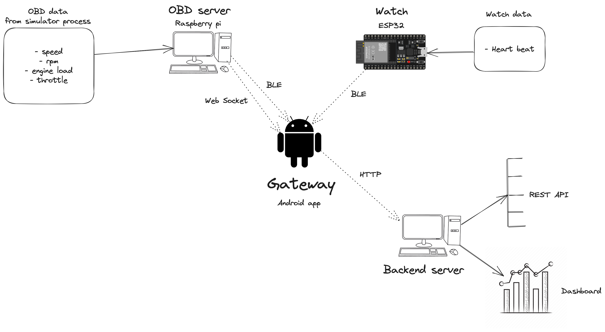
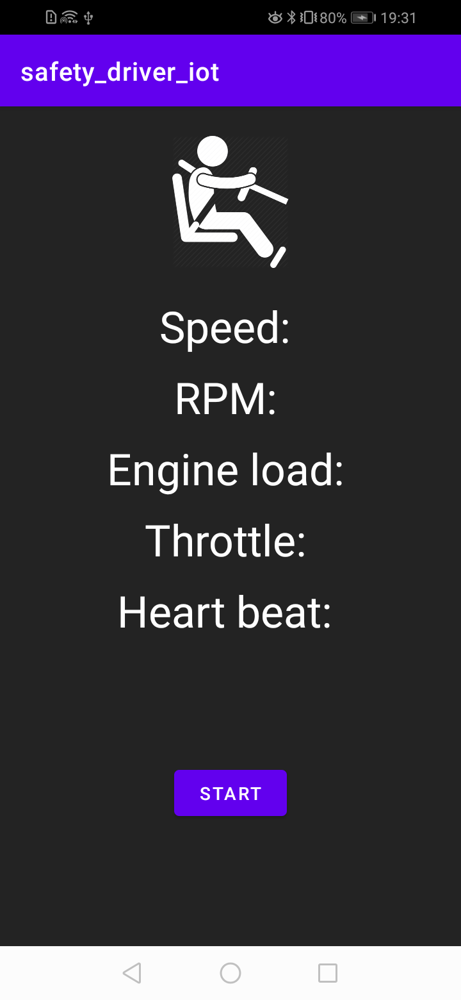
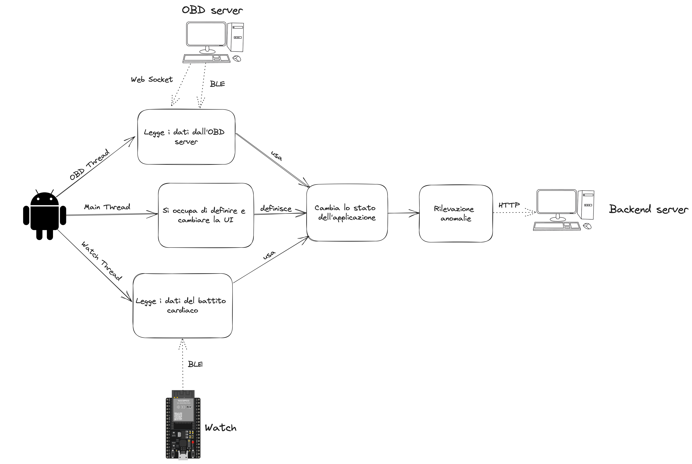

# Driver safety - Gateway

## Architettura del progetto
Il progetto ha come obbiettivo di fare una prototipo per un sistema di safety del driver, monitorando alcuni parametri caratteristici, svolgendo una prima anomaly detection su questi dati e inviando i relativi alert a un sistema che li rende disponibili tramite REST API e in maniera grafica tramite delle dashboard.
Le componenti usate sono:
- OBD server: utilizzando un simulatore di dati OBD-II, fornisce al gateway i relativi dati usando il BLE e la comunicazione tramite Web Socket (per motivi di testing). Il componente è disponibile al seguente [link](https://github.com/UniSalento-IDALab-IoTCourse-2022-2023/wot-project-2022-2023-OBDsimulator-Culcea_Merico)
- Watch: simulato tramite una board ESP32 che fornisce il valore del battito tramite BLE. Il componente è disponibile al seguente [link](https://github.com/UniSalento-IDALab-IoTCourse-2022-2023/culcea-merico__driver_safety_watch).
- Gateway: applicazione Android che prende i dati collegandosi all'OBD server e al Watch, svolge una anomaly detection prototipale usando dei valori di soglia per il battito cardiaco e l'accelerazione. Gli alert generati sono inviati tramite rete mobile al backend. Il componente è disponibile al seguente [link](https://github.com/UniSalento-IDALab-IoTCourse-2022-2023/culcea-merico__driver_safety_gateway).
- Backend: server che salva i dati di alert inviati del gateway, fornisce una REST API per poterne fare uso e permette di visualizzare una dashboard real-time dei dati aggregati. Il componente è disponibile al seguente [link](https://github.com/UniSalento-IDALab-IoTCourse-2022-2023/wot-project-2022-2023-Dashboard-Cloud-Culcea_Merico).

## Esecuzione

Per eseguire il programma:
- Svolgere i preparativi
- Avviare il simulatore
- Avviare il watch
- Avviare il backend
- Eseguire il programma

### Preparativi
Prima di eseguire l'applicazione, bisogna scrivere i valori corretti nel file di configurazione (a partire dalla root del progetto) `./app/src/main/java/a/b/Config.kt`. Bisogna specificare:
1. Informazioni sul web socket del simulatore: indirizzo ip del device dove si sta eseguendo il simulatore e porta per il web socket; la porta deve corrispondere alla porta usata all'interno del codice del simulatore (analizzare il README del relativo progetto).
2. Informazioni sul bluetooth del simulatore: indirizzo bluetooth del device dove si sta eseguendo il simulatore.
3. Assicurarsi che gli UUID del servizio e delle caratteristiche corrispondano a quelli specificati all'interno del file di configurazione del progetto del simulatore.
4. Informazioni sul bluetooth low energy del watch: indirizzo bluetooth del device che svolge la funzionalità di watch
5. Assicurarsi che gli UUID del servizio e della caratteristica del battito corrispondono a quelli specificati nel progetto del watch
6. Assicurarsi che le informazioni sul backend siano corrette, in particolare l'indirizzo IP della macchina su cui si esegue il backend e eventualmente la porta.

### Avviare il simulatore
Avviare il simulatore come specificato nel README del relativo progetto.

### Avviare il watch
Avviare il simulatore come specificato nel README del relativo progetto.

### Avviare il backend 
Avviare il backend come specificato nel README del relativo progetto.

### Esecuzione usando Android Studio
- Collegare il proprio telefono Android e metterlo in modalità debugging USB.
- Eseguire il codice

All'inizio l'applicazione si avvierà mostrando dei valori vuoti per i vari parametri analizzati:

Dopo aver cliccato sul bottone "Start", avverrà la connessione e i valori letti verranno mostrati su schermo:

## Spiegazione codice

La UI dell'applicazione è definita in `./app/src/main/res/layout/activity_main.xml` e l'Activity associate è definita in `./app/src/main/res/java/a.b/MainActivity.kt`.
L'Activity è una classe con proprietà:
- Le `TextView` per manipolare il layout dell'applicazione e scrivere i valori aggiornati del battito cardiaco e dell'OBD.
- Le variabili globali di gestione dello stato. C'é una variabile per lo stato attuale, una variabile per lo stato appena precedente e una variabile per conservare il timestamp dell'ultima osservazione dei dati OBD. Tutte queste servono poi per svolgere correttamente l'anomaly detection.

I metodi principali dell'Activity sono:
- `onCreate`: metodo invocato all'avvio dell'applicazione. Sono inizializzati i valori delle `TextView` e quelli del bottone presente. Viene definito il click listener per il bottone; quando questo viene premuto scompare e sono avviate due thread: una thread per il watch e una thread per il simulator. Queste thread hanno come parametri fondamentali la funzione per cambiare lo stato e l'istanza dell'activity che serve in vari altri punti del codice e per eseguire nella main thread i cambiamenti di UI.
- `change_state`: Questa è la funzione per cambiare lo stato e svolgere anomaly detection dopo che lo stato è cambiato. Alle varie thread viene passata questa funzione, una volta ottenuti i dati, definisco una funzione di transizione di stato e invocano la funzione passata con argomenti la funzione di transizione di stato definita, il timestamp associato ai dati e un valore enum per identificare quale thread ha chiamato questa funzione. 

### OBD Thread
Oltre alla funzione per cambiare lo stato e l'istanza dell'activity, questa thread riceve un valore enum per scegliere se collegarsi al server OBD tramite WebSocket oppure tramite BLE. La funzione controlla quindi questo valore e si collega di conseguenza.

#### WebSocket
Le funzionalità di WebSocket sono astratte in un file Kotlin separato, questo file è una funzione che prende come argomento l'url del server a cui collegarsi e una funzione di callback che definisce cosa fare con il messaggio ricevuto. Questi parametri sono usati per istanziare un `WebSocketClient` con i metodi `onOpen` (all'apertura della connessione), `onMessage` (all'arrivo del messaggio), `onClose` (alla chiusura della connessione), `onError` (per errore nella connessione).

Prima di invocare la funzionalità di websocket, viene definita la funzione di callback: questa prende la stringa ricevuta, ne fa il parsing, definisce la funzione di transizione di stato (che serve per aggiornare i valori) e la usa per invocare la funzione di cambiamento di stato passata come parametro all'inizio. La funzione di callback è poi passata alla funzione per usare il WebSocket.

#### BLE
Le funzionalità di BLE sono astratte in una classe Kotlin separata. Questa classe ha un costruttore che inizializza delle variabili per la gestione del Bluetooth, fa dei controlli e in caso positivo si collega al device.

Come parametri per la classe BLE c'è l'indirizzo Bluetooth del GATT server, dati associati ai servizi e la main Activity. I dati associati ai servizi contengono la stringa dell'uuid del servizio e un arrai di dati sulle caratteristiche del relativo servizio. I dati della caratteristica contengono l'uuid della caratteristica e una funzione che prende la stringa del valore della caratteristica e svolge un'azione. Così come per il GATT c'è la gerarchia dei servizi che contengono caratteristiche, nell'applicazione ci sono dei dati associati ai servizi che contengono dei dati associati alle caratteristiche dove per ogni caratteristica c'è la funzione che definisce cosa fare con un nuovo valore per quella caratteristica.

La classe BLE prova a collegarsi al device e in caso di successo si collega al GATT server specificando un oggetto di callback ottenuto invocando la funzione `mk_gatt_callback`. L'oggetto di callback serve per definire cosa fare al variare dei valori delle caratteristiche, l'oggetto ha i seguenti metodi:
- `onConnectionStateChange`: gestisce i cambi di stato della connessione GATT. In caso di successo, si inizia a fare la discovery dei servizi.
- `onServicesDiscovered`: Dopo le la discovery dei servizi è avviata e i servizi sono stati trovati, viene invocata questa funzione che per ogni servizio invoca la funzione `do_for_service` passando i relativi dati del servizio.
- `do_for_service`: dato il servizio, viene fatto un loop su ogni caratteristica e viene attivata una notifica per ogni cambio di valore per la caratteristica. Quando questo valore cambia, viene invocata la funzione `onCharacteristicChanged`
- `onCharacteristicChanged`: utilizzando l'uuid della caratteristica, si trovano i relativi dati della caratteristica (quelli iniziali passati come parametri alla costruttore della classe che contiene la funzione associata alla caratteristica) e si estra la funzione associata che viene invocata passando la stringa del nuovo valore della caratteristica.

Quindi la classe BLE inizializza le variabili, si collega al device e definisce il GATT callback che specifica cosa fare al cambio dei valori.

L'OBD thread, quindi, quando usa il Bluetooth, definisce prima i dati per ogni caratteristica, in particolare la funzione associata alla caratteristica. La funzione associata legge il valore (una stringa con timestamp, delimitatore e valore), fa lo split del timestamp e del valore, definisce la funzione di transizione di stato e invoca la funzione di cambiamento di stato all'interno della main thread (utilizzando il main Activity passato come argomento iniziale insieme alla funzione di cambiamento di stato); questo per ogni caratteristica. Dopo aver definito i dati delle caratteristiche, viene definito il dato per il singolo servizio dell'OBD simulator passando l'uuid del servizio e l'array dei dati delle caratteristiche. Infine viene instanziata la classe BLE passando i dati del servizio (che contiene quindi i dati delle caratteristiche): ogni volta che il valore di una caratteristica cambia, la relativa funzione viene invocata, ovvero avviene il cambiamento di stato dell'applicazione aggiornando il nuovo valore.

### Watch thread
Questa thread utilizza le funzionalità astratte nella classe BLE. Quindi prima definisce i dati della caratteristica del battito cardiaco: la relativa funzione prende il valore, definisce la funzione di transizione di stato (che serve per aggiornare il valore del battito cardiaco) e invoca nella main thread la funzione di cambiamento di stato. I dati della caratteristica sono usati per definire i dati del servizio e i dati del servizio sono passati alla classe BLE insieme all'indirizzo BLE del watch e la main Activity passata come argomento insieme alla funzione di cambiamento di stato.

### Cambiamento di stato e anomaly detection
Questa funzionalità si trova all'interno della funzione `change_state`. Lo stato è rappresentato nel tipo record `State_data` e contiene le informazioni sulla velocità, RPM, engine load, throttle, battito cardiaco.

All'inizio viene eseguita la funzione di transizione di stato passata come argomento, questo cambia lo stato corrente. I valori della UI sono aggiornati di conseguenza. Poi viene svolta anomaly detection per il battito cardiaco se il tipo di thread (specificata come terzo argomento della funzione) è quella del watch (che aggiorna il valore del battito cardiaco), altrimenti viene svolta anomaly detection per l'accelerazione se il il tipo di thread è quella del simulatore (che aggiorna anche il valore dell'accelerazione).

Infine si aggiornano i valori di stato riguardo il timestamp dell'ultima osservazione OBD (solo se la thread è quella del simulatore) e riguardo lo stato precedente.

L'invio della post request è svolto in una thread a parte.

#### Anomaly detection sul battito
È stato considerato come valore di soglia 70, quindi se il battito scende sotto questa soglia, viene definita una stringa json con i valori del timestamp e del battito e inviata tramite post request all'endpoint degli alert del battito del backend.

#### Anomaly detection sull'accelerazione
Viene prima calcolata l'accellerazione usando il timestamp corrente, il timestamp dell'ultima osservazione dei dati OBD (variabile di stato della Main Activity), lo stato corrente e lo stato precedente (variabile di stato della Main Activity). La funzione per il calcolo dell'accelerazione gestisce tramite Optional la conversione dei valori in maniera tale che l'accelerazione sia espressa in $\frac{m}{s^2}$.

È stato considerato come valore di soglia 3, quindi se l'accelerazione in valore assoluto supera questa soglia, viene definita una stringa json con i valori del timestamp e dell'accelerazione e inviata tramite post request all'endpoint degli alert dell'accelerazione del backend.